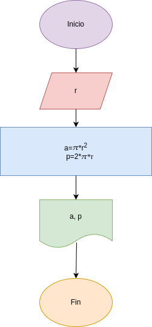

# Programa 1: area_perimetro_circulo
Programa en Python para calcular el área y el perímetro de un circulo dado que el valor de su radio

## Análisis

### Variables de entrada
- r: radio del círculo

### Procesamiento
- a: área del círculo
- p: perimetro del círculo

$a = \pi*r²$

$p = 2*\pi*r$

## Diseño

## Construcción
- codigo implementado en el archivo "area_perimetro_circulo.py"
